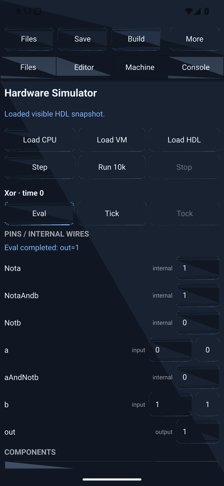
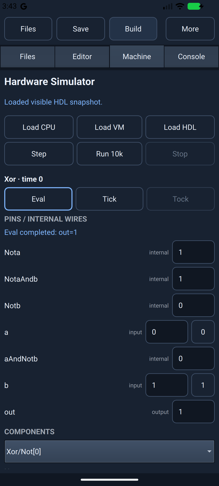
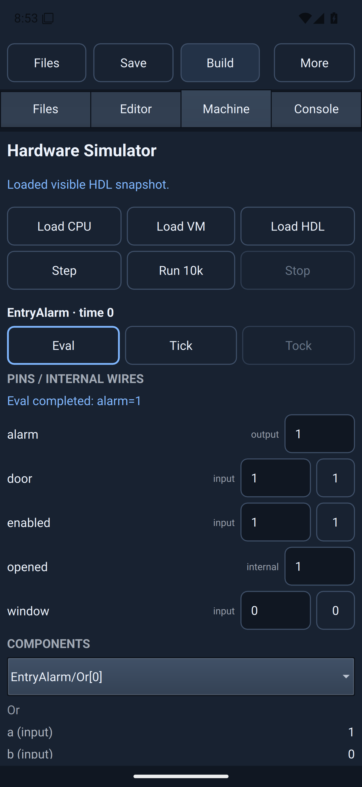

# Android rendering investigation

The simulator can execute correctly while the display is corrupted. We therefore
check captured images as well as touch events and backend state.

| Test | Result |
| --- | --- |
| 0.1.8, default OpenGL, CI API 36 | Workflow passed, but images had triangular corruption |
| 0.1.8, local emulator default GPU | Workflow passed, but captured app surfaces were black |
| 0.1.9 candidate c4be00a, Qt software renderer | Blank surface; new screenshot gate failed and blocked release |
| Unchanged 0.1.8 APK, local SwiftShader, OpenGL | Triangle corruption remained |
| Same APK and emulator, Vulkan override | Clean captures and full tested workspace/Eval workflow passed |
| 0.1.9 b3485f4, automatic Vulkan, CI API 36 | Workflow passed; menu and course captures are readable, with EntryAlarm visibly `alarm=1` |

The revised candidate probes a Vulkan instance and physical device before
preferring Vulkan. If unavailable, Qt keeps its platform default. This is not
automatic recovery from every subsequent driver failure. Physical ARM64 devices,
16 KB runtime compatibility and unsupported-driver cases remain unverified.

These are actual emulator screenshots of the reported composite Xor. They are not
mockups or retouched images. The Vulkan image uses a development launch override
on the released 0.1.8 APK; automatic selection in the revised app requires its own
CI result. The OpenGL image is from CI; the Vulkan image is from the local emulator.
Both show `a=0`, `b=1`, `out=1`.

| OpenGL corruption | Controlled Vulkan result |
| --- | --- |
|  |  |

The controlled test passed Downloads import/edit/save/assemble/export/reopen,
unchanged original inputs, actual Xor pin/Eval taps, and offline course-copy and
EntryAlarm Eval. [The evidence record](evidence/android-vulkan-controlled.json)
includes the exact APK hash. It is a 4 KB x86-64 emulator test, not physical ARM64
or 16 KB qualification.

For reproduction on an isolated emulator, install Pillow 12.0.0 and run
`scripts/check_android_toolbar.py APK REPORT --workspace-flow --graphics-backend vulkan`.
Omit `--graphics-backend` to test the shipped renderer selection. The override is
development-only and uses the debug APK's Qt launch support. The screenshot guard
rejects flat captures while excluding system bars; manually inspect remaining
images for corruption, clipped controls and readability.

## Shipped selection: 0.1.9

[CI 36399208565](https://github.com/ilcde/nandstudio-native/actions/runs/36399208565)
passed with automatic Vulkan selection (`graphics_api=5`), without a launch
override. The [workflow record](evidence/android-workflow-0.1.9.json) identifies
the tested APK. The menus are below the system status bar, and the course capture
shows the evaluated result:

The Xor backend assertion passed, but its captured image shows the earlier loaded
state. Capturing after a state report does not necessarily wait for a presented
frame. That image is not evidence of a visibly updated Xor result; screenshot
synchronization remains an open test limitation. The independent controlled run
above did capture the visible Xor result. Neither run qualifies all devices.
