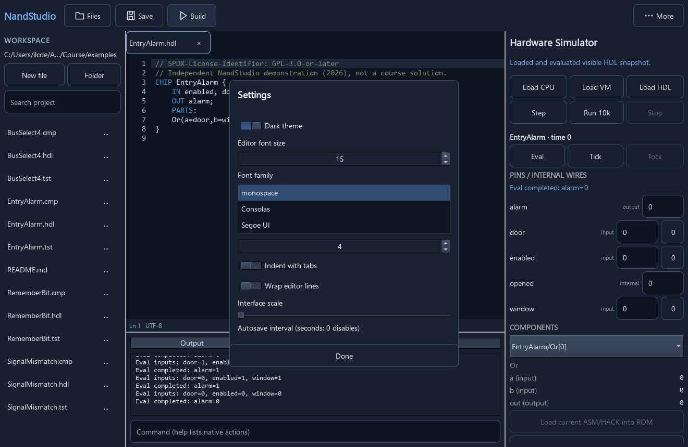
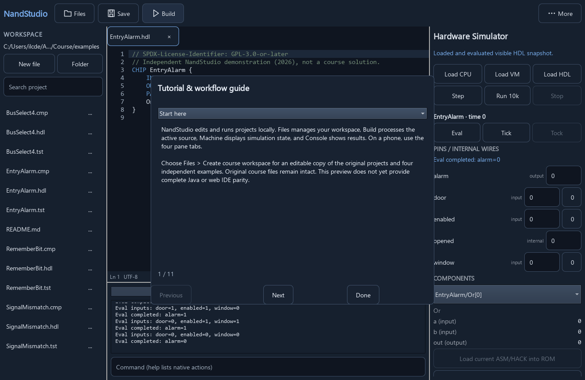
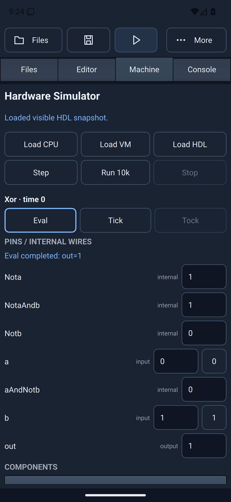
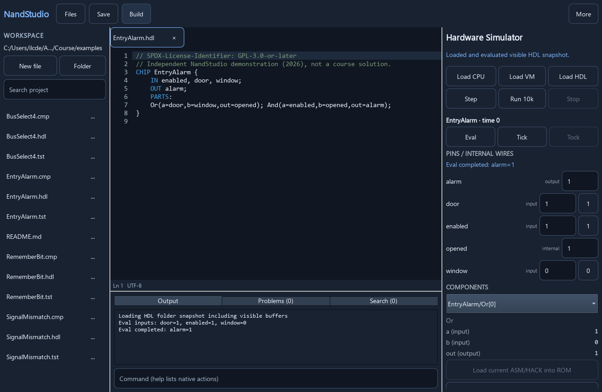
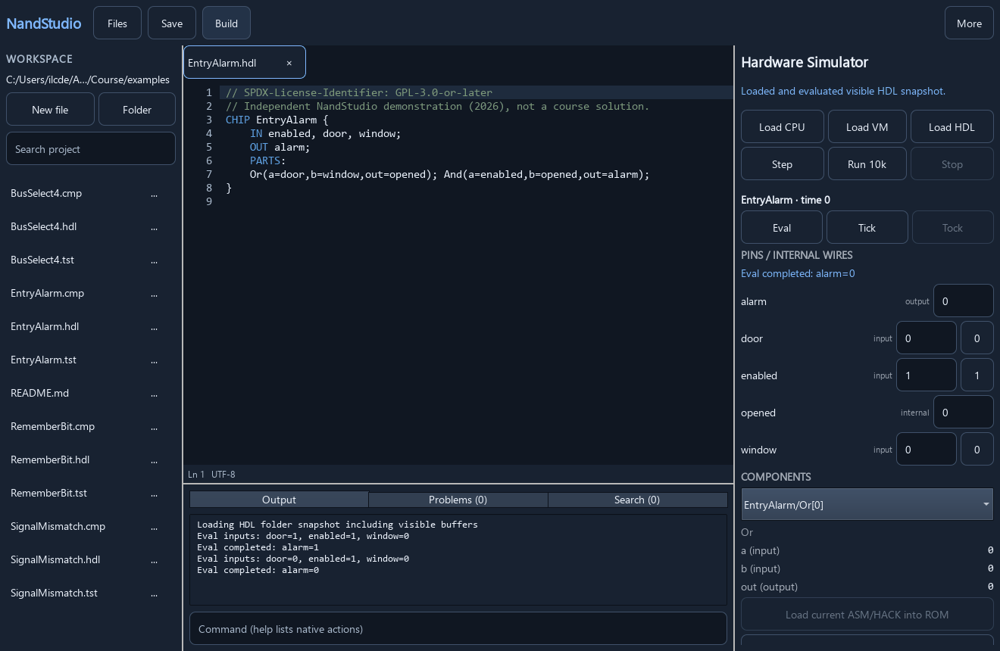
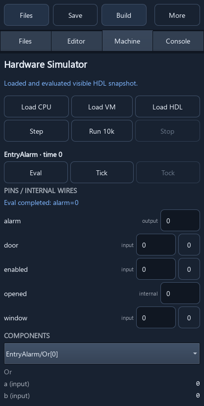
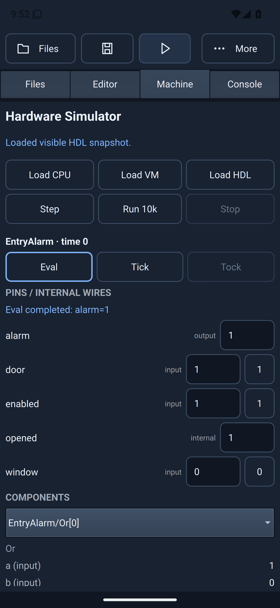
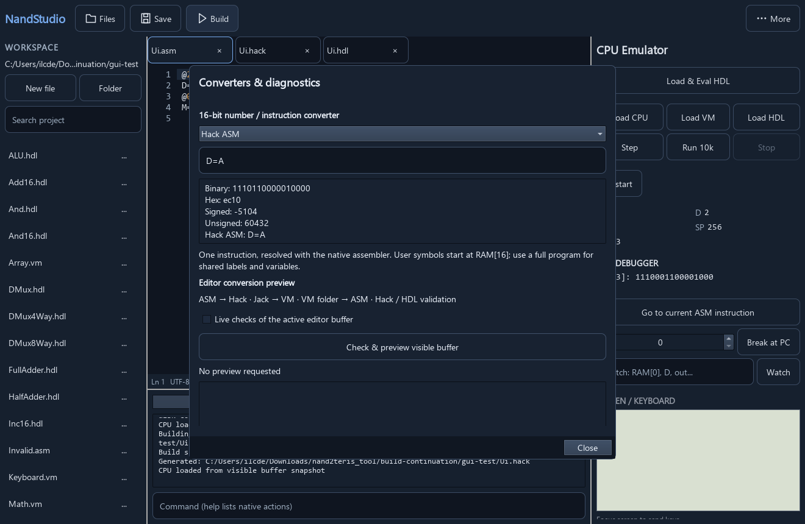

# Real application demonstrations

## Font picker and offline tutorial





These Windows offscreen Qt captures use the real EntryAlarm example and the
application's own dialogs. The GIF advances through four topics at 4.5 seconds
per frame; it is a sequence of test-driven captures, not a manual interaction
recording. Font choices reflect this test environment, not every Windows font.
See [the tutorial guide](tutorial.md) for controls and workflow diagrams.

Reproduce with `NAND_DEMO_CAPTURE=1` and the GUI self-test, then run
`python scripts/make_demo_gif.py CAPTURE_DIRECTORY docs/images/tutorial.gif --prefix tutorial-frame --duration 4500`.

## Android 0.1.10



This API 36 x86-64 emulator capture comes from successful CI 36402288659. The
original-resolution image shows `a=0`, `b=1`, `out=1` and all toolbar icons.
The [workflow evidence](evidence/android-workflow-0.1.10.json) records the APK
hash and actual interaction results. This does not qualify physical ARM64
devices or every tutorial/font-picker interaction.

See the separate [Android rendering comparison](android-rendering.md) for actual
emulator screenshots and controlled Vulkan workflow evidence.

These images were captured from the native Qt Quick application on Windows on
28 September 2026. The simulator evaluated every displayed state; these are not
mockups. The capture runner drives the shared C++ service directly. This demonstrates
the rendered state, not a recording of manual mouse or touchscreen input.



## HDL Eval animation



The animation uses four unretouched application captures, 1.8 seconds per frame.
`EntryAlarm` computes `enabled AND (door OR window)`.

| Frame | enabled | door | window | alarm |
|---|---:|---:|---:|---:|
| 1 | 1 | 0 | 0 | 0 |
| 2 | 1 | 1 | 0 | 1 |
| 3 | 1 | 0 | 1 | 1 |
| 4 | 0 | 0 | 0 | 0 |

## Narrow layout



This is a 412 by 820 Windows window showing the responsive Machine pane. It is
not an Android device screenshot and does not establish status-bar, keyboard or
storage-provider compatibility. Android interaction evidence is recorded separately
in the release manifest and [platform register](platforms.json).

## Try the examples

Choose **Files > Create course workspace**, then open its `examples` folder.
All six examples include `.hdl`, `.tst` and `.cmp` files:

| Example | What to inspect |
|---|---|
| EntryAlarm | Enable input and two event inputs; inspect the internal wire |
| SignalMismatch | All four combinations of two one-bit inputs |
| BusSelect4 | Four-bit buses, sub-bus connections and selector values |
| Parity3 | Odd parity across three signals; all eight combinations |
| Majority3 | Majority decision across three signals; all eight combinations |
| RememberBit | Capture, hold and replace a stored bit using Tick and Tock |

Open an HDL file, choose **Load HDL**, change its input pins and choose **Eval**.
For RememberBit, use **Tick** followed by **Tock** to commit a clock cycle. Open
the corresponding `.tst` and run the HDL test action to compare every scripted
output with its `.cmp`. Desktop CLI equivalents are `HardwareSimulator NAME.tst`.

These are independently written GPL-3.0-or-later demonstrations, separate from
the original course assignments. The 249 original files under `projects` retain
their own notices and remain byte-for-byte unchanged. Do not copy completed
examples over starter exercises. See the [course coverage guide](course-workflows.md)
and [remaining work](TODO.md); full twelve-project compatibility is unfinished.

## Reproduce the captures

Build the GUI with the pinned toolchain described in [build instructions](build.md).
Set `QT_QUICK_BACKEND=software`, `QT_QPA_PLATFORM=offscreen`, and
`NAND_DEMO_CAPTURE=1`; then run `NandStudio --self-test ABSOLUTE_OUTPUT_DIRECTORY`.
Use a fresh writable output directory and set `NAND_TEST_STATE_DIR` to a separate
writable directory. The executable must have access to its deployed Qt plugins.
The runner verifies the original project hashes and every displayed output before
saving the PNG files. A nonzero exit indicates a failed capture or assertion.

With development-only Pillow 12.0.0 installed, run:

```text
python scripts/make_demo_gif.py ABSOLUTE_OUTPUT_DIRECTORY docs/images/hdl-eval.gif
```

Copy `course-demo.png` and `course-phone-layout.png` from the output directory to
`docs/images`. Review the images before publishing. Python and Pillow are not
application runtime dependencies.

## Android 0.1.11 course example



This unretouched API 36 emulator image from CI 36405309943 shows the offline
course-copy workflow and `alarm=1`. The toolbar sits below the status bar.
[The raw workflow report](evidence/android-workflow-0.1.11.json) records backend
and storage assertions. That run's Xor capture was stale (`out=0`) despite a
passing backend `out=1` assertion; it is not used as a successful visual demo.
Frame synchronization and physical Android device qualification remain open.

## Native instruction converter



Actual Windows Qt capture from the 0.1.12 candidate GUI regression. Choose
**More > Converters & diagnostics > Hack ASM** and enter a single instruction.
`D=A` displays binary `1110110000010000`, hex `ec10`, signed `-5104` and unsigned
`60432`. Numeric inputs also show canonical assembly when the encoding has one.
This action writes no files and does not change the running machine. Symbol
resolution follows the desktop assembler; see [web comparison](web-ide-parity.md).
