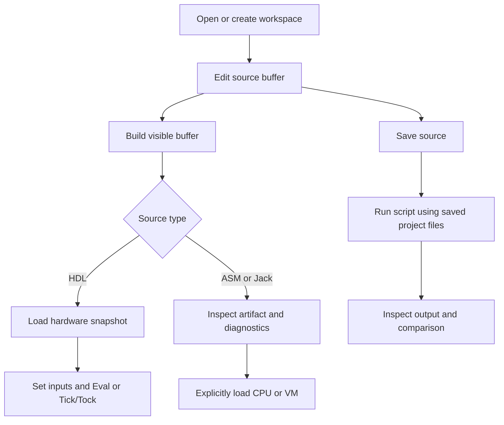
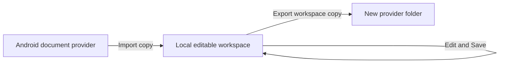

# In-app tutorial and interface controls

Open **More > Tutorial & workflow guide**, or press **F1** on a hardware
keyboard. The guide is bundled and works offline. Use the topic selector to
jump to a workflow, or Previous and Next to read in sequence. On narrow displays,
instructions scroll inside the dialog.

The guide explains implemented workflows. It is not an answer key or a claim
of complete compatibility. Student starter files remain unchanged. See the
[course coverage](course-workflows.md) and [remaining work](TODO.md).

## Choose an editor font

Open **More > Settings** and select a family from **Font family**. Choices come
from Qt's installed-font database on the current device. The sample updates
immediately; editor size is controlled separately. Selection persists in local
preferences. A previously saved family remains listed even if unavailable;
Qt may substitute another font. The generic `monospace` option remains available.

No font is downloaded or redistributed. Choices can differ between platforms.

## Toolbar icons

Files, Save, Build and More use locally drawn vector symbols. Wide layouts keep
text labels. Narrow layouts show Save and Build as icons to conserve space;
their accessible names remain **Save** and **Build**. Keyboard focus, enabled
state and existing actions are preserved. No emoji font or icon download is needed.

| Symbol | Action | Result |
| --- | --- | --- |
| Folder | Files | Open workspace and document operations |
| Disk | Save | Save the active document |
| Triangle | Build | Process the active source according to its file type |
| Three dots | More | Open tools, tutorial, theme and settings |

Build loads HDL; Eval is a separate explicit action. Compiling Jack or assembly
does not replace a running machine automatically.

## Workflow and data boundaries

**Compile Jack folder** includes open sibling buffers and compiles every source
before committing output. Conflicting or unsaved VM outputs block replacement.
Test scripts use saved files: save relevant sources before running a script.

Import does not create a live synchronization link. Export important work before
uninstalling, clearing app storage or moving to another device.

## Verification scope

GUI checks exercise font selection, persistence, tutorial navigation, every topic
and phone-sized dialog bounds. Demonstration images come from the application
test runner. A narrow Windows window is not Android device qualification;
consult [the platform register](platforms.json) for actual coverage.
